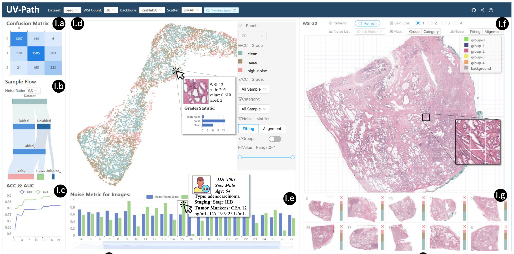

Learning-Enabled Histopathological Evaluation

UV-Path, an interactive  $\textcolor{green}{U}ncertainty-aware$ $\textcolor{blue}{V}isualization$ framework that facilitates $\textcolor{orange}{A}ctive \textcolor{red}{L}earning$ for deep learning-based histo$\textcolor{red}{Path}$ological image analysis. **UV-Path** includes a noise-hard sample monitoring module, which allows experts to review samples and intervene in the model outcomes during the active learning (AL) process, enhancing both learning performance and transparency.

The related paper, "UV-Path: Uncertainty-aware Visual Analytics for Weakly Supervised Learning on Histopathological Images," has been submitted to VIS 2023.



## Model Base on Active Learning Framework


# Datasets

We used two publicly available datasets: [PESO](https://zenodo.org/record/1485967#.Yz2NbuzMJ_A) and [Hubmap](https://www.kaggle.com/competitions/hubmap-organ-segmentation/data?select=train.csv).

- PESO (cancer classification):  A large set of WSI of prostatectomy specimens with various grades of prostate cancer. All the WSIs are stained with H&E and nearly 10,000×10,000 pixels.

```
|_ datasets
    |     |_ peso/
    |         |_ init_data/
    |             |_ train_dataset.npy/
    |             |_ test_dataset.npy/
    |             |_ init_labeled_set.npy/
    |             |_ init_unlabeled_set.npy/
    |             |_ bk_dataset.npy/
    |         |_ init_data_image/
    |             |_ image_0/
    |                 ...
    |             |_ image_29/
```

- Hubmap (cancer segmentation):  The slides in the dataset are all 3000 x 3000 pixels, and the tissue area in each image is approximately 2500 x 2500 pixels and prepared with the periodate-Schiff (PAS)/hematoxylin and eosin (H&E) staining method.

```
|_ datasets
    |     |_ hubmap/
    |         |_ 1000_pixel_images/
    |             |_ train/
    |                |_ largeintestine/
    |                   ...
    |                |_ spleen/
    |             |_ masks/
    |                |_ largeintestine/
    |                   ...
    |                |_ spleen/
```

## Generating `.npy` files and tiling WSIs for visualization

Training our model with PESO dataset requires inputs in `.npy` format.

1. Open python file: `cut_slider.py`
2. Configure each `path` according to your environment and set `img_num` to determine the number of WSIs you need.
3. Run this python file by typing `python cut_slider.py`,where

> `init_peso_WSI_train_percent` i s used to tile WSIs from PESO dataset according to cancer ratio in each patch. `npy_data_init_percent` is the corresponding function used to generate each `.npy` file.

But for the Hubmap dataset, you need to do a simple pre-processing.

1. Convert 3000 ×3000 resolution WSIs to a model-recognizable size of 1024 ×1024.
2. The sliced masks contained in the corresponding region can be extracted from the `.csv` file in the dataset.
3. Generate `train` and `masks` folders and individual regions accordingly.

# How to start ?

The **UV-Path** project contains: `build`. `build` is a [React](https://react.dev/) app, its showcases the various visual solutions we have designed (see our paper).

Before starting UV-Path, make sure the [node.js]([nodejs.org](https://nodejs.org/en)) has been installed.

1. Download the [data.zip]() file, unzip it and put it into the `build` folder.
2. For starting `node_moudles`, you can simply typing

   ```
   cd ./UV-Path
   npm i
   ```
3. Start the demo with

   ```
   npm start
   ```
4. Then navigate to `http://localhost:3000/` in your browser to see demo of **UV-Path** .

# Critations

```
...
```
